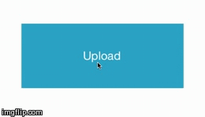

CircularProgressButton
===================

Subclass of **UIButton** which animates into and display circular progress
*Entirely written in swift*

Features
---------

Customisable properties:

- Original state properties
 - `originalCornerRadius: CGFloat` 
 - `originalColor: CGColor`
 - `originalBorderColor: CGColor`
- Small state properties
 - `smallCornerRadius: CGFloat`
 - `smallColor: CGColor`
 - `smallBorderColor: CGColor`

**Preview**



How to use
---------

> **Note**: Currently avaliable onle through code (no IB support)

Code for initializing button

```
let buttonFrame = CGRect(x: 0, y: 0, width: 250, height: 100)
let button = CircularProgressButton(frame: buttonFrame, cornerRadius: 20)
button.setTitle("Upload", forState: .Normal)
```

Installing
---------

 2. Copy `CircularProgressButton.swift` into your project
 3. Use it


> The MIT License (MIT)
> 
> Copyright (c) 2015 Dmytro Cheverda
> 
> Permission is hereby granted, free of charge, to any person obtaining
> a copy of this software and associated documentation files (the
> "Software"), to deal in the Software without restriction, including
> without limitation the rights to use, copy, modify, merge, publish,
> distribute, sublicense, and/or sell copies of the Software, and to
> permit persons to whom the Software is furnished to do so, subject to
> the following conditions:
> 
> The above copyright notice and this permission notice shall be
> included in all copies or substantial portions of the Software.
> 
> THE SOFTWARE IS PROVIDED "AS IS", WITHOUT WARRANTY OF ANY KIND,
> EXPRESS OR IMPLIED, INCLUDING BUT NOT LIMITED TO THE WARRANTIES OF
> MERCHANTABILITY, FITNESS FOR A PARTICULAR PURPOSE AND NONINFRINGEMENT.
> IN NO EVENT SHALL THE AUTHORS OR COPYRIGHT HOLDERS BE LIABLE FOR ANY
> CLAIM, DAMAGES OR OTHER LIABILITY, WHETHER IN AN ACTION OF CONTRACT,
> TORT OR OTHERWISE, ARISING FROM, OUT OF OR IN CONNECTION WITH THE
> SOFTWARE OR THE USE OR OTHER DEALINGS IN THE SOFTWARE.
